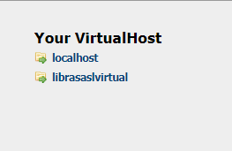

# LibrasASL

Site de Libras e ASL, com tradução

## Passos para rodar o Projeto:

-   Execute o Wamp Server
-   Acesse `localhost`
-   Procure pelo VirtualHost correspondente ao projeto

    

### Caso for a primeira vez:

-   Tenha o Wamp Server + PHP instalado
-   Procure pela opção `Add a VirtualHost`
    -   No 1º input preencha com um nome que corresponda como por ex: `librasasl`
    -   No 2º input preencha o caminho da pasta raiz do projeto

**Obs:** pasta validators é referente a formulários como cadastro e login.

-   Subpastas semânticas em arquivos `Js`
-   utilizar `require_once('conexao.php');` para chamar a conexão com banco de dados

### DEVs, por gentileza, verifiquem os TODOs!!

#### Hospedagem free

https://cpanel.infinityfree.com/panel/indexpl.php
https://panel.000webhost.com/onboarding
